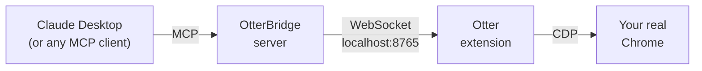

<div align="center">


# Otter & OtterBridge — Browser MCP

**Let your AI assistant drive your real Chrome — and ask you first before anything risky.**

[](https://github.com/wen-da-ng/otterbridge-browser-mcp/releases/latest)
[](LICENSE)
[](https://modelcontextprotocol.io)
[](extension/)
[](https://github.com/wen-da-ng/otterbridge-browser-mcp/releases/latest)

[Install](#install--claude-desktop) ·
[How it works](#how-it-works) ·
[Tools](#what-your-ai-can-do) ·
[Security](#safety--security) ·
[For developers](#for-developers)

</div>

> **For personal use only.** Not for publication or distribution. It operates
> your real, logged-in browser (see [Security](#safety--security)).

## How it works

Two pieces work together: the **Otter** Chrome extension (the hands & eyes) and
the **OtterBridge** MCP server (the connector). Any MCP client can drive it —
Claude Desktop, Claude Code, MCP Inspector, or your own agent.



Your AI assistant reads pages, clicks, fills forms, scrolls, waits for dynamic
content, takes screenshots — and debugs web apps via the captured console and
network traffic — with a visible animated cursor, an audit log, and a hard
rule: clicks on anything that looks destructive (*Buy, Pay, Send, Delete…*)
stop and ask **you** first.

## Install — Claude Desktop

All you need is **Google Chrome** and **Claude Desktop** — no Node.js, no git,
no terminal.

**1 — Download two files** from the
[latest release](https://github.com/wen-da-ng/otterbridge-browser-mcp/releases/latest):
`otterbridge.mcpb` and `otter-extension.zip`.

**2 — Add the extension to Chrome:** unzip `otter-extension.zip` to a permanent
spot (e.g. `Documents\Otter` — Chrome keeps loading it from there, so don't
delete it later). Then open `chrome://extensions`, switch on **Developer mode**
(top-right), click **Load unpacked**, and pick the unzipped `extension` folder.

**3 — Add the bridge to Claude Desktop:** double-click `otterbridge.mcpb` and
confirm the install. Two safety checkboxes appear — **keep the defaults**.

**4 — Try it:** with Chrome open, ask Claude:
*"Open example.com and tell me what's on the page."*

<details>
<summary><b>No release download available?</b></summary>

Use the direct copy of
[`otterbridge.mcpb`](https://github.com/wen-da-ng/otterbridge-browser-mcp/raw/main/server/otterbridge.mcpb),
and for the extension click the green **Code** button on the repo page →
**Download ZIP** (the extension is the `extension` folder inside).
</details>

<details>
<summary><b>Troubleshooting</b></summary>

- **Nothing happens?** Make sure Chrome is open and the Otter extension is
  loaded (`chrome://extensions`). The extension reconnects automatically.
- A **"Chrome is being debugged" banner** appears at the top — normal and
  harmless; websites can't see it.
- `chrome://` pages, the Chrome Web Store, and PDFs can't be read or clicked —
  Chrome doesn't allow it.
</details>

## What your AI can do

Twenty-six tools, each taking an optional `tab` id — plus multi-tab,
multi-agent control where every MCP session gets its own colored Chrome tab
group.

<details>
<summary><b>Observe &amp; navigate (9)</b></summary>

| Tool | Does |
|---|---|
| `navigate(url, tab?)` | Point a tab at a URL, wait for load. |
| `go_back(tab?)` / `go_forward(tab?)` | Move through the tab's history. |
| `reload(hard?, tab?)` | Reload the tab; `hard` bypasses the cache. |
| `read_page(offset?, max_chars?, tab?)` | URL, title, visible text — paginated: result carries `total_chars`, pass `offset` for the next chunk. |
| `read_elements(tab?)` | Numbered interactive elements with center coordinates. |
| `find_text(query, nth?, scroll?, tab?)` | Case-insensitive text search: match coordinates + context, auto-scrolls a match into view. |
| `wait_for(text?, selector?, timeout_ms?, tab?)` | Wait for dynamic content (text and/or CSS selector) instead of polling screenshots. |
| `screenshot(full_page?, tab?)` | JPEG of the viewport — or the whole page — via CDP (works on background tabs too). |
</details>

<details>
<summary><b>Act (9)</b></summary>

| Tool | Does |
|---|---|
| `click_element(index, tab?)` | **Preferred.** Clicks a `read_elements` entry by index; coordinate resolved in-page, so it never drifts through screenshot scaling. |
| `click(x, y, tab?)` | Animated-cursor move + trusted CDP click at raw coordinates. Destructive targets prompt for approval. |
| `fill_element(index, text, tab?)` | Focus + select-all + type over, atomically — the reliable way to fill form fields. Empty text clears. |
| `select_option(index, value?/label?, tab?)` | Pick an option in a native `<select>` (dropdowns can't be clicked). |
| `hover(index?/x,y?, tab?)` | Animated hover — opens hover menus, tooltips, `:hover` states. |
| `drag(from_x, from_y, to_x, to_y, tab?)` | Press–glide–release — sliders, sortable lists, canvas tools. |
| `type_text(text, tab?)` | Per-character typing with human-like jitter, into the focused element. |
| `press_key(key, tab?)` | e.g. `Enter`, `Tab`, `Escape`. |
| `scroll(delta_y, tab?)` | Vertical scroll with jittered delta. |
</details>

<details>
<summary><b>Debug web apps (4)</b></summary>

| Tool | Does |
|---|---|
| `read_console(level?, limit?, clear?, tab?)` | Captured `console.*` output, uncaught exceptions, and browser log (500-entry ring buffer per tab). |
| `read_network(filter?, limit?, clear?, tab?)` | Captured requests: URL, method, status, type, size (300-entry ring buffer). |
| `get_network_body(request_id, tab?)` | Response body of a captured request (truncated at 50k chars). |
| `evaluate_js(code, tab?)` | Run JavaScript in the page. **Off by default** — enable in the extension options, and every call still asks for your approval. |
</details>

<details>
<summary><b>Multi-tab / multi-agent</b></summary>

Each MCP **session** is an agent with its own colored Chrome **tab group**.
Manage tabs with `open_tab(url?)`, `list_tabs()`, `use_tab(tab)`,
`close_tab(tab)`. Multiple agents (sessions) can drive multiple tabs
**simultaneously** — the server routes each session's commands to its own tab,
and a single agent never steals focus from another (background tabs are driven
via CDP without activation).
</details>

<details>
<summary><b>Cursor &amp; input settings</b></summary>

The extension has a settings UI — the toolbar **popup** (preset switch + master
cursor toggle) and a full **options page** (right-click the icon → Options).
Tune move speed, curvature, easing, typing speed, scroll, idle drift, cursor
size/colors/glow, and visibility — with **presets** (Natural / Fast / Instant)
and a live preview. Settings sync via `chrome.storage.sync` and apply live.
</details>

## Safety & security

Every action is **audit-logged**, destructive clicks require **your approval**,
and everything binds to **localhost only** — nothing is exposed to the network.

<details>
<summary><b>Full security model</b></summary>

- **Audit log:** every dispatched action is appended to `server/agent_actions.log`.
- **Destructive-action gate:** a `click` whose target text matches danger words
  (`buy/pay/delete/send/submit/checkout/confirm/transfer/…`) is hit-tested at
  dispatch and requires human approval via MCP elicitation. Works for every
  click — vision-mode, `read_elements`, or raw coordinates.
  - `BROWSER_AGENT_GATE=elicit` (default) | `off` (also accepts `true`/`false`)
  - `BROWSER_AGENT_GATE_FALLBACK=deny` (default) | `allow` — used only if a
    client can't show an elicitation prompt. (The `.mcpb` exposes both as
    checkboxes in Claude Desktop's settings.)
- **`evaluate_js` is doubly gated:** disabled unless you switch it on in the
  extension's options page (Advanced), and even then every call goes through
  the same human-approval elicitation as destructive clicks.
- Servers bind to **localhost only**. Never expose them on the network.
- **Bridge & endpoint are origin/host-locked** (defense against local-page
  attacks): the `ws://localhost:8765` bridge only accepts the extension
  (`chrome-extension://` origin) or non-browser clients — a web page you visit
  can't connect to eavesdrop on or displace it. The HTTP endpoint rejects
  requests whose `Host`/`Origin` isn't loopback, blocking DNS-rebinding attempts
  to drive the browser from a malicious site.
- **Supply chain:** install with `npm ci --ignore-scripts`; no production
  dependency runs install scripts, and the committed `package-lock.json` pins
  versions. The shipped `.mcpb` is a single bundled file (no loose deps).
- Runs in your **real Chrome profile** (real logins). For isolation, load the
  extension in a dedicated Chrome profile instead.
- Main residual threat is **prompt injection** from page content; keep the gate on.
</details>

## For developers

Everything below needs **git** and **Node.js ≥ 18** — regular Claude Desktop
users never touch this. Run **only one** server at a time (Node, legacy Python,
**or** the `.mcpb` inside Claude Desktop) — they share the `ws://localhost:8765`
bridge and only one process can own it.

<details>
<summary><b>Components</b></summary>

| Path | What it is |
|---|---|
| `extension/` | Chrome MV3 extension — the hands & eyes. WebSocket client + `chrome.debugger` (CDP) input + animated fake cursor + a settings UI (popup + options page). |
| `server/` | **OtterBridge (Node/TypeScript)** — the MCP server. Bridges browser actions to the extension over `ws://localhost:8765`, with two transports from one codebase: **stdio** (for the `.mcpb` / Claude Desktop) and **streamable HTTP** at `http://localhost:8000/mcp` (for Claude Code, MCP Inspector). Bundles into a one-click `.mcpb`. |
| `legacy/` | The original **Python** (FastMCP) server + its setup scripts, kept as a reference/fallback. Single-tab only. See [`legacy/README.md`](legacy/README.md). |
</details>

<details>
<summary><b>Claude Code</b></summary>

```bash
git clone https://github.com/wen-da-ng/otterbridge-browser-mcp.git
cd otterbridge-browser-mcp/server
npm ci --ignore-scripts   # reproducible install, no dependency install scripts
npm run build
npm start                 # streamable HTTP at http://localhost:8000/mcp
```

Load the extension from your clone's `extension/` folder, wait for
`[bridge] extension connected`, then register the server once:

```
claude mcp add --transport http otterbridge-browser-mcp http://localhost:8000/mcp
```
</details>

<details>
<summary><b>MCP Inspector / any other MCP client</b></summary>

Start the server (`cd server && npm start`), then point the client at the
streamable-HTTP endpoint:
```
npx @modelcontextprotocol/inspector
```
Transport `Streamable HTTP` → `http://localhost:8000/mcp`.
</details>

<details>
<summary><b>Build the <code>.mcpb</code> from source / releases</b></summary>

```bash
cd server
npm ci --ignore-scripts
npm run pack              # esbuild bundle + LICENSE + mcpb pack → otterbridge.mcpb
```

Releases are automated: pushing a `v*` tag makes CI run the test suite, pack
`otterbridge.mcpb`, zip the extension, and attach both to a GitHub release.
</details>

<details>
<summary><b>Legacy Python server</b></summary>

The original Python implementation lives in [`legacy/`](legacy/) with its own
setup scripts (`bootstrap` + `start`) and docs. It's single-tab only. See
[`legacy/README.md`](legacy/README.md).
</details>

<details>
<summary><b>Reloading after code changes</b></summary>

| Changed | Do |
|---|---|
| `extension/*.js` | Reload the extension at `chrome://extensions` (↻), then refresh open tabs. |
| `server/src/*.ts` (Claude Code / Inspector) | `npm run build` in `server/`; restart the server; in Claude Code run `/mcp` to reconnect. |
| `server/src/*.ts` (Claude Desktop `.mcpb`) | Re-pack (`npm run pack` in `server/`) and reinstall the bundle. |
| `legacy/server-python/server.py` | See [`legacy/README.md`](legacy/README.md). |
</details>

<details>
<summary><b>Notes &amp; gotchas</b></summary>

- `chrome://` pages, the Web Store, and PDFs can't be read or clicked (they
  reject script injection).
- The **"Chrome is being debugged" banner** is cosmetic and unavoidable with
  `chrome.debugger`; websites cannot see it.
- Detection avoidance comes from running in your real browser, not the cursor
  animation.
- Some sites (e.g. Shopee) gate automated browsing of logged-out sessions behind
  an anti-bot / login wall; log in first for deep browsing.
</details>

## Roadmap

- [x] `.mcpb` Desktop Extension — one-click install in Claude Desktop, zero prerequisites
- [x] Multi-tab / multi-agent — per-session tab groups + parallel control
- [x] Rookie-friendly releases — prebuilt `.mcpb` + extension zip on every release
- [ ] Chrome Web Store (unlisted) — extension installs from a link, no Developer mode
- [ ] Detection refinements — brief-attach debugger, extra behavioral jitter, cursor overshoot
- [ ] Standalone example agent client (LangGraph/Ollama) — any MCP client can already attach

---

<div align="center">

_Built by <b>wen-da-ng</b> · OtterBridge_

</div>
