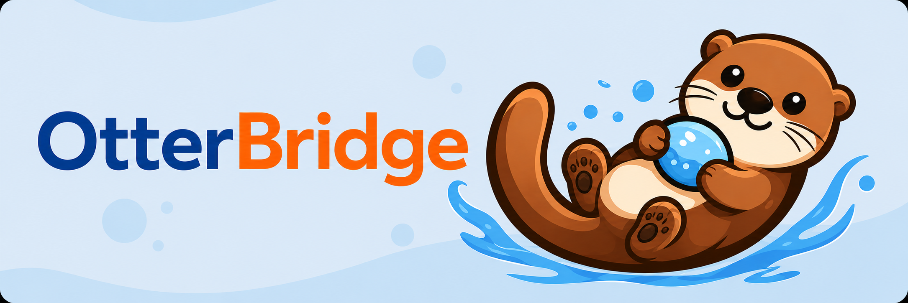

# Otter — Browser Agent · OtterBridge

A personal "Claude in Chrome"-style browser agent. The **Otter** Chrome
extension is the hands & eyes; **OtterBridge** is the standard MCP server that
any MCP client can use to drive your real Chrome — Claude Code, Claude Cowork,
MCP Inspector, or a LangGraph/Ollama agent loop.

_Built by **wen-da-ng** · OtterBridge_



> **For personal use only.** Not for publication or distribution. It operates
> your real, logged-in browser (see [Security](#security)).

**Status: complete.** Bridge, observation tools, input + animated cursor,
vision (screenshots), and server-side safety are all implemented and verified.

## Components

| Path | What it is |
|---|---|
| `extension/` | Chrome MV3 extension — the hands & eyes. WebSocket client + `chrome.debugger` (CDP) input + animated fake cursor. |
| `server/` | **OtterBridge** — standard MCP server (FastMCP, streamable HTTP at `http://localhost:8000/mcp`) bridging tools to the extension over `ws://localhost:8765`. |
| `agent/` | *Optional* example MCP client (LangGraph). Not needed — any MCP client can attach. Deferred. |

The server speaks **two transports from one codebase**: streamable HTTP at
`http://localhost:8000/mcp` (default — for Claude Code, MCP Inspector, any HTTP
client) and **stdio** (`--stdio` — for Claude Desktop, which launches the
server itself). Both modes host the `ws://localhost:8765` bridge to the
extension.

## Quick start

### Step 1 — Load the Otter extension *(everyone, one time)*

Chrome → `chrome://extensions` → enable **Developer mode** → **Load unpacked** →
select the `extension` folder. Required regardless of which client you use.

### Step 2 — Set up the server *(everyone, one time — no prerequisites)*

You do **not** need Python or `uv` pre-installed; the bootstrap installs both
(via [uv](https://docs.astral.sh/uv/), which downloads Python 3.12 for you).

| OS | Run |
|---|---|
| Windows | `.\bootstrap.ps1` |
| macOS / Linux | `chmod +x bootstrap.sh start.sh && ./bootstrap.sh` |

### Step 3 — Attach your MCP client

Pick the one you use:

<details open>
<summary><b>A · Claude Code</b> — Windows / macOS / Linux</summary>

1. Start the server — `.\start.ps1` (Windows) or `./start.sh` (macOS/Linux).
   Wait for `[bridge] extension connected` (the extension auto-reconnects).
2. Register it (once):
   ```
   claude mcp add --transport http otterbridge http://localhost:8000/mcp
   ```
</details>

<details>
<summary><b>B · Claude Desktop</b> — Windows / macOS / Linux (beta)</summary>

Desktop **launches the server for you** over stdio, so do **not** run
`start.ps1`/`start.sh` — that would fight for the `:8765` bridge port. You only
need the extension loaded (Step 1) and the venv created (Step 2).

Open **Settings → Developer → Edit Config**, then add the block below, using
**absolute paths** to this repo. Restart Claude Desktop afterward.

The config file lives at:

| OS | Path |
|---|---|
| Windows | `%APPDATA%\Claude\claude_desktop_config.json` |
| macOS | `~/Library/Application Support/Claude/claude_desktop_config.json` |
| Linux | `~/.config/Claude/claude_desktop_config.json` |

**Windows** (note the doubled backslashes):
```json
{
  "mcpServers": {
    "otterbridge": {
      "command": "C:\\path\\to\\Otter-Chrome\\.venv\\Scripts\\python.exe",
      "args": ["C:\\path\\to\\Otter-Chrome\\server\\server.py", "--stdio"]
    }
  }
}
```

**macOS / Linux:**
```json
{
  "mcpServers": {
    "otterbridge": {
      "command": "/path/to/Otter-Chrome/.venv/bin/python",
      "args": ["/path/to/Otter-Chrome/server/server.py", "--stdio"]
    }
  }
}
```

> Claude Desktop only speaks **stdio** to local servers — a plain `"url"` entry
> is silently ignored, and Custom Connectors require a public `https://` URL, so
> neither can reach `http://localhost:8000` directly. The `--stdio` launch above
> is the supported path; a stdio→HTTP `mcp-remote` bridge is the alternative if
> you prefer to keep a standalone HTTP server running.
</details>

<details>
<summary><b>C · MCP Inspector / any other MCP client</b></summary>

Start the server (`start.ps1` / `start.sh`), then point the client at the
streamable-HTTP endpoint:
```
npx @modelcontextprotocol/inspector
```
Transport `Streamable HTTP` → `http://localhost:8000/mcp`.
</details>

## Tools

| Tool | Does |
|---|---|
| `navigate(url)` | Point the active tab at a URL, wait for load. |
| `read_page()` | URL, title, visible text (≤20k chars) + `devicePixelRatio`. |
| `read_elements()` | Numbered interactive elements with center coordinates. |
| `click_element(index)` | **Preferred.** Clicks a `read_elements` entry by index; coordinate is resolved in-page, so it never drifts through screenshot scaling. |
| `click(x, y)` | Animated-cursor move + trusted CDP click at raw coordinates. Destructive targets prompt for approval. |
| `type_text(text)` | Per-character typing with human-like jitter. |
| `press_key(key)` | e.g. `Enter`, `Tab`, `Escape`. |
| `scroll(delta_y)` | Vertical scroll with jittered delta. |
| `screenshot()` | JPEG image of the viewport for *seeing* the page. For precise clicks use `read_elements` + `click_element`. |

## Security

- **Audit log:** every dispatched action is appended to `server/agent_actions.log`.
- **Destructive-action gate:** a `click` whose target text matches danger words
  (`buy/pay/delete/send/submit/checkout/confirm/transfer/…`) is hit-tested at
  dispatch and requires human approval via MCP elicitation. Works for every
  click — vision-mode, `read_elements`, or raw coordinates.
  - `BROWSER_AGENT_GATE=elicit` (default) | `off`
  - `BROWSER_AGENT_GATE_FALLBACK=deny` (default) | `allow` — used only if a
    client can't show an elicitation prompt.
- Servers bind to **localhost only**. Never expose them on the network.
- Runs in your **real Chrome profile** (real logins). For isolation, load the
  extension in a dedicated Chrome profile instead.
- Main residual threat is **prompt injection** from page content; keep the gate on.

## Reloading after code changes

| Changed | Do |
|---|---|
| `extension/*.js` | Reload the extension at `chrome://extensions` (↻). |
| `server/server.py` (Claude Code / Inspector) | Restart the server; in Claude Code run `/mcp` to reconnect. |
| `server/server.py` (Claude Desktop) | Fully quit and reopen Claude Desktop — it relaunches the stdio server. |

## Notes & gotchas

- Tools act on the **focused Chrome tab**. `chrome://` pages, the Web Store, and
  PDFs can't be read or clicked (they reject script injection).
- The **"Chrome is being debugged" banner** is cosmetic and unavoidable with
  `chrome.debugger`; websites cannot see it.
- Detection avoidance comes from running in your real browser, not the cursor
  animation. See `browser-agent-dev-guide.md` §10.

## Setup difficulty by audience

| You are | Path | Prerequisites |
|---|---|---|
| Comfortable with a terminal | Run `bootstrap` + `start`, register the client. | None — bootstrap installs `uv` + Python. |
| Not technical | Wait for the phase-2 one-click packaging below. | (planned: none) |

The remaining friction for a non-technical friend is *two* manual steps that
no script can remove today: loading an **unpacked** Chrome extension (needs
Developer mode) and editing a JSON config / running a terminal command. Phase 2
removes both.

## Roadmap — phase 2 (true one-click, for non-technical users)

- **Chrome Web Store (unlisted):** publish the extension so it installs with one
  click from a private link — no Developer mode, no unpacked folder.
- **`.mcpb` Desktop Extension:** package the server as an MCP Bundle for
  double-click install in Claude Desktop (Settings → Extensions → Install).
  Node.js ships inside Claude Desktop but Python does not, so this likely means
  porting the ~250-line server to the TypeScript MCP SDK (`ws` for the bridge)
  so the bundle needs **zero** runtime prerequisites.

## Not done (optional)

- §10 detection refinements: brief-attach debugger, extra behavioral jitter,
  cursor overshoot. Only matters against aggressive anti-bot sites.
- The standalone LangGraph client in `agent/` (deferred — Claude Code already
  serves as a working agent client).
